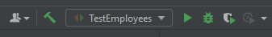
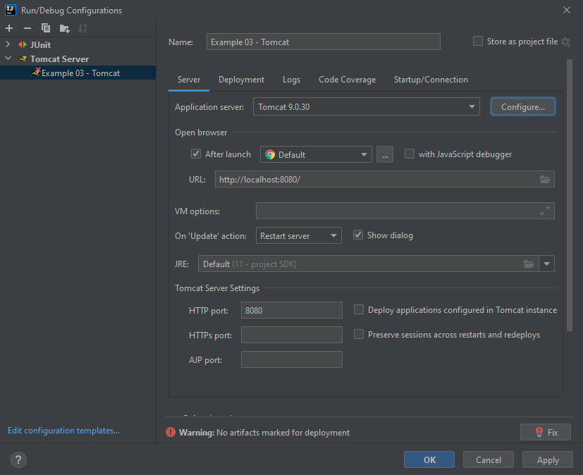
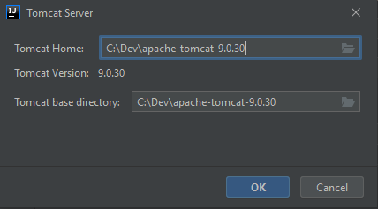
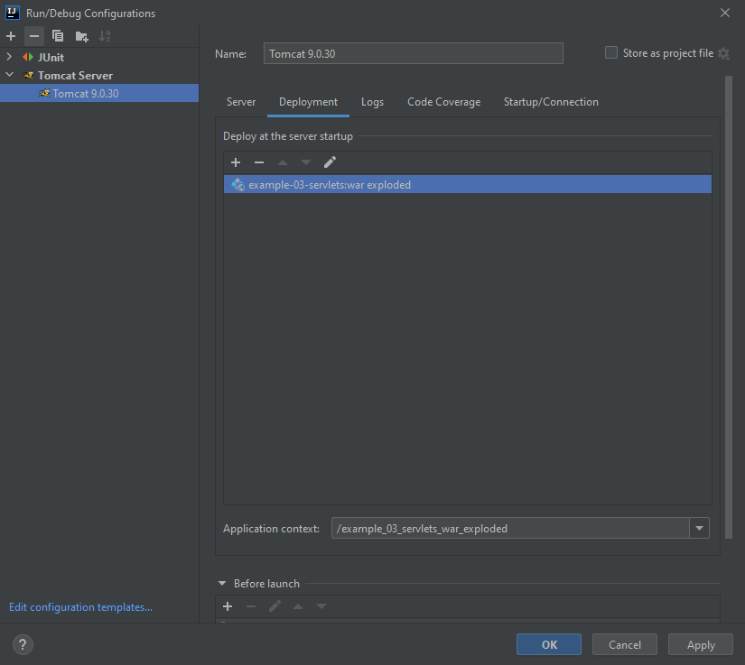
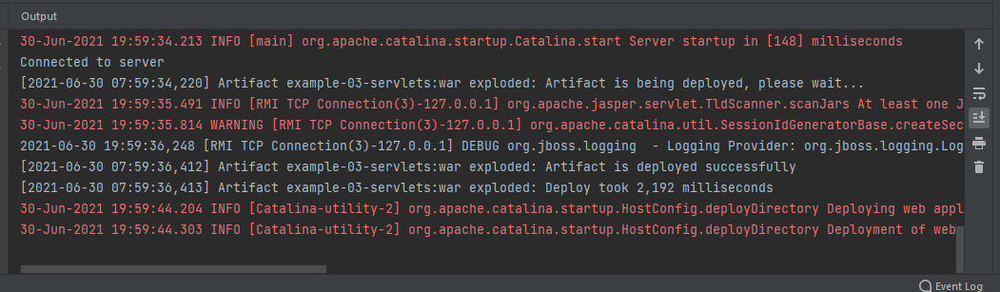

# SE325 Example 03 - Java Servlets
This project contains two examples of Java servlets.

Servlets run inside a *servlet container* such as [Apache Tomcat](http://tomcat.apache.org/), and handle a subset of the HTTP requests sent to that servlet container, according to their configuration. Such configuration can be either by annotations, or by a [`web.xml`](./src/main/webapp/WEB-INF/web.xml) config file. This example shows the `web.xml` approach.

As you can see in the [POM file](./pom.xml) for this project, the `<packaging>` of servlets is set to `war` (line 11). This will result in a `*.war` file being produced instead of a `*.jar` file, when we execute Maven's `package` goal.

## Running the example in Tomcat from IntelliJ IDEA Ultimate Edition
**Important**: This **will not work** on the Community edition. Make sure you download and install the Ultimate edition from [JetBrains' website](https://www.jetbrains.com/) (this is included on all lab machines). The Ultimate edition is free for academic use - simply create your JetBrains account using your University email address.

1. Download [Tomcat 9.x](https://tomcat.apache.org/download-90.cgi), either the Zip or the 64-bit Windows zip, and put it somewhere on your machine (only do this if you haven't configured Tomcat on your machine yet).

2. Click on the drop-down menu of the "run configurations" toolbar, usually found in the top-right corner. It should look similar to the screenshot below. Choose "Edit configurations".

3. Click the "+" button at the top-left, and choose Tomcat ➡ Local

4. Under "Application server", select your Tomcat instance. If you can't see it, click "configure".

5. If you need to configure, the dialog below will appear. Browse to your Tomcat instance you downloaded earlier.

6. There may be an error saying "No artifacts marked for deployment". Click the "Fix" button.

7. In the tab which appears, select either the "war" or "war exploded" artifact for deployment (it doesn't matter too much). Maven should have created these when the project was originally imported.

8. Note the "Application context". You can set this to whatever you like. This is to be included in the URL when the server is running. For example, if the server is running on `localhost:8080`, and the context is `/hello`, and the Servlet endpoint itself is `/world`, then the URL to access that particular Servlet endpoint would be `http://localhost:8080/hello/world`.

9. Back on the "Server" tab, choose the port. Port `8080` is a fine default, but may not work on the lab machines, or other machines where this port is already in use. `10000` has been found to work ok on the lab machines.

10. Click "Ok".

11. Run Tomcat (and your deployed Servlets) by clicking the green "Play" button on the toolbar. Tomcat will start, and then your Servlets will be deployed to it. You can see the message "Artifact is deployed successfully " in the server console, as shown in the following screenshot.

12. You can browse to <http://localhost:8080/example_03_servlets_war_exploded/hello> in a web browser (assuming you didn't change the port or application context away from their defaults. If you did, modify the URL accordingly). You should see the text "Hello, world!" appear in the browser. This text is generated by the `HelloWorldServlet` class. The path `/hello` is configured to point to that Servlet within `web.xml`.

13. While Tomcat is running, you may run either of the provided clients. Again, remember to change the URLs within them, according to your configured port and application context.

14. Remember to stop Tomcat when done.